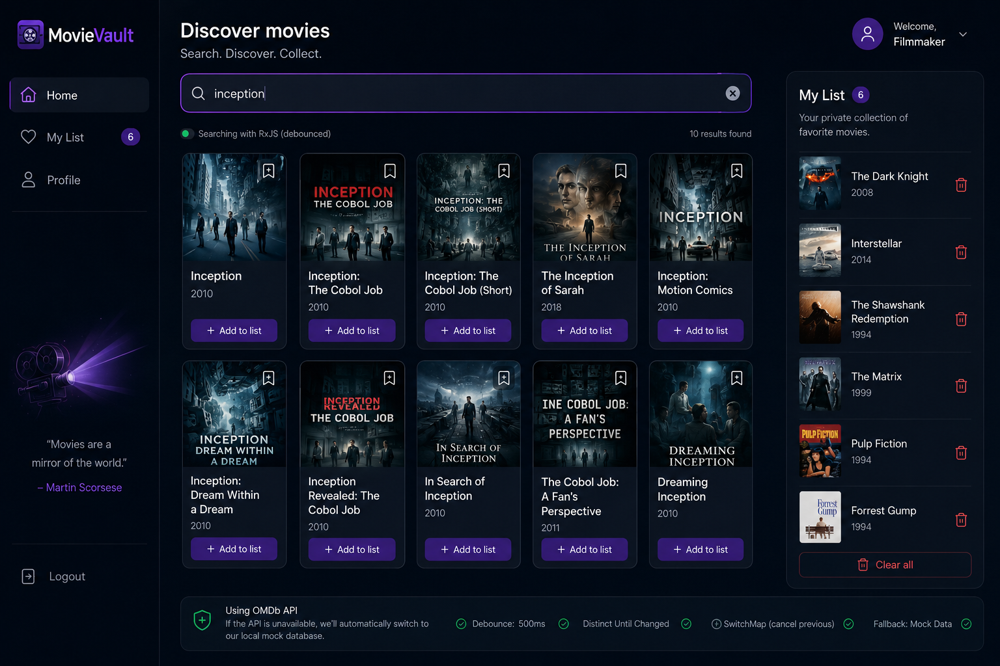

# MovieVault 🎬
Aplikacja do odkrywania i kolekcjonowania filmów, zbudowana w React. Wpisz tytuł — wyniki pojawiają się same. Znajdź coś ciekawego — dodaj do swojej prywatnej listy. Prosto i bez zbędnego szumu.

## Co robi?
MovieVault łączy się z bazą danych OMDb, żeby w czasie rzeczywistym odpowiadać na Twoje zapytania. Wpisujesz literkę, a aplikacja — dzięki RxJS — czeka cierpliwie aż skończysz pisać, zanim w ogóle wyśle request do API. Zero spamowania. Zero zbędnych wywołań.

Jeśli klucz API zawiedzie albo sieć będzie kaprysiła, aplikacja bez żadnego błędu przełącza się na lokalną bazę mockową — 10 sprawdzonych tytułów, które są tam zawsze.

Zapisane filmy trafiają do `localStorage`. Przeglądarka pamięta Twoją listę nawet po odświeżeniu strony.

## Stos technologiczny
| Warstwa | Technologia |
| :--- | :--- |
| **UI** | React 19 + Vite |
| **Routing** | React Router v7 |
| **Animacje** | Framer Motion |
| **Ikony** | Lucide React |
| **Stylowanie** | Tailwind CSS |
| **Logika asynchroniczna** | RxJS (debounce + distinctUntilChanged + switchMap) |
| **Zewnętrzne API** | OMDb API |
| **Fallback danych** | Mock lokalny |

## Struktura projektu
```text
src/
├── api/
│   └── mockData.js        # Lokalna baza filmów jako fallback
├── components/
│   └── Login.jsx          # Formularz logowania
├── pages/
│   ├── MoviesList.jsx     # Główny widok z wyszukiwarką
│   └── MyList.jsx         # Prywatna lista filmów
├── App.jsx                # Routing, nawigacja, stan
└── main.jsx
```
